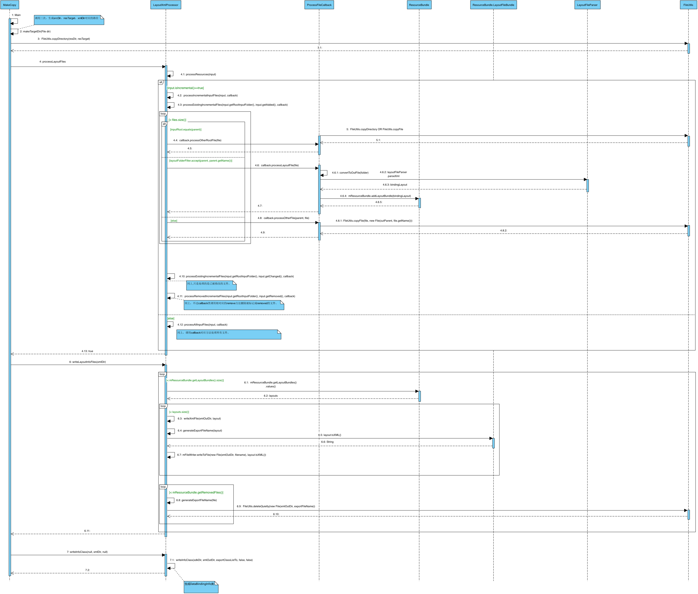
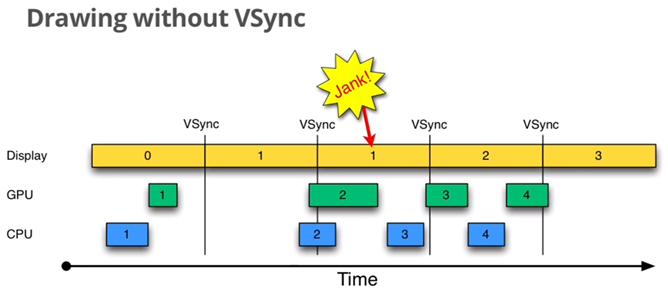
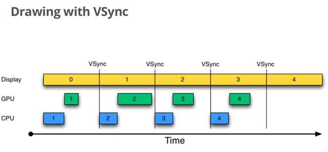

#DataBinding
##DataBinding apt,generate相关
 
 
## DataBinding之executePendingBindings

```java
	public void setComment(com.loopeer.android.apps.marukoya.model.Comment comment) {
        this.mComment = comment;
        synchronized(this) {
            mDirtyFlags |= 0x2L;
        }
        notifyPropertyChanged(BR.comment);
        super.requestRebind();
    }
```
设置参数之后调用requestRebind
```java
	protected void requestRebind() {
		synchronized (this) {
			if (mPendingRebind) {
				return;
				}
				mPendingRebind = true;
        }
        if (USE_CHOREOGRAPHER) {
			mChoreographer.postFrameCallback(mFrameCallback);
        } else {
            mUIThreadHandler.post(mRebindRunnable);
        }

    }
```
**SDK_INT > 16** 时候使用Choreographer，否则直接将runnable加入到主线程消息队列末尾，执行到任务时执行executePendingBindings

**Choreographer**
Choreographer调用postFrameCallback，理解成handler post callback一样，内部实现postFrameCallback->postFrameCallbackDelayed->postCallbackDelayedInternal->scheduleFrameLocked

```java
    private void scheduleFrameLocked(long now) {
        if (!mFrameScheduled) {
            mFrameScheduled = true;
            if (USE_VSYNC) {
                if (DEBUG_FRAMES) {
                    Log.d(TAG, "Scheduling next frame on vsync.");
                }

                // If running on the Looper thread, then schedule the vsync immediately,
                // otherwise post a message to schedule the vsync from the UI thread
                // as soon as possible.
                if (isRunningOnLooperThreadLocked()) {
                    scheduleVsyncLocked();
                } else {
                    Message msg = mHandler.obtainMessage(MSG_DO_SCHEDULE_VSYNC);
                    msg.setAsynchronous(true);
                    mHandler.sendMessageAtFrontOfQueue(msg);
                }
            } else {
                final long nextFrameTime = Math.max(
                        mLastFrameTimeNanos / TimeUtils.NANOS_PER_MS + sFrameDelay, now);
                if (DEBUG_FRAMES) {
                    Log.d(TAG, "Scheduling next frame in " + (nextFrameTime - now) + " ms.");
                }
                Message msg = mHandler.obtainMessage(MSG_DO_FRAME);
                msg.setAsynchronous(true);
                mHandler.sendMessageAtTime(msg, nextFrameTime);
            }
        }
    }
```

判断是否可以用垂直同步，如果时不是垂直同步，加入消息队列，任务执行时调用Choreographer.doFrame,然后调用callback,执行viewdatabinding里面的framecallback

```java
	 mFrameCallback = new Choreographer.FrameCallback() {
                @Override
                public void doFrame(long frameTimeNanos) {
                    mRebindRunnable.run();
                }
            };
```          
在runnable里面执行executePendingBindings
```java            
    private final Runnable mRebindRunnable = new Runnable() {
        @Override
        public void run() {
            synchronized (this) {
                mPendingRebind = false;
            }
            if (VERSION.SDK_INT >= VERSION_CODES.KITKAT) {
                // Nested so that we don't get a lint warning in IntelliJ
                if (!mRoot.isAttachedToWindow()) {
                    // Don't execute the pending bindings until the View
                    // is attached again.
                    mRoot.removeOnAttachStateChangeListener(ROOT_REATTACHED_LISTENER);
                    mRoot.addOnAttachStateChangeListener(ROOT_REATTACHED_LISTENER);
                    return;
                }
            }
            executePendingBindings();
        }
    };
```
如果支持垂直同步，则判断是否是在当前的消息线程，如果是立即执行垂直同步，否则加入到队列里面，最后执行
```java
	 private void scheduleVsyncLocked() {
        mDisplayEventReceiver.scheduleVsync();
    }
```
 调用DisplayEventReceiver的native方法
 ```java
     public void scheduleVsync() {
        if (mReceiverPtr == 0) {
            Log.w(TAG, "Attempted to schedule a vertical sync pulse but the display event "
                    + "receiver has already been disposed.");
        } else {
            nativeScheduleVsync(mReceiverPtr);
        }
    }
```
对应文件frameworks/base/core/jni/android_view_DisplayEventReceiver.cpp,最后处理后，调用dispatchVsync->onVsync
```java
FrameDisplayEventReceiver.onVsync

	Message msg = Message.obtain(mHandler, this);
            msg.setAsynchronous(true);
            mHandler.sendMessageAtTime(msg, timestampNanos / TimeUtils.NANOS_PER_MS);
```
this指FrameDisplayEventReceiver这个runnable实现，故调用
```java
	 @Override
	 public void run() {
            mHavePendingVsync = false;
            doFrame(mTimestampNanos, mFrame);
        }
```
doFrame也会最后调用framecallback，执行到executePendingBindings，最后调用executeBindings执行绑定，所以如果是setVariable而不加executePendingBindings时，中间会因为垂直同步而，至少一帧的去延时bind数据，这样，在recyclerview里面造成了抖动，所以需要在setVariable后面调用executePendingBindings，这样立即调用executeBindings，最后一起渲染到视图上。

[Vsync原理](http://www.androidpolice.com/2012/07/12/getting-to-know-android-4-1-part-3-project-butter-how-it-works-and-what-it-added/)

大致意思是大多数设备是每秒刷60帧，这样每帧就有16ms的处理时间，如果超过这样的时间就会造成卡顿。假如一个绘制过程是8ms,但是这个处理，在即将刷新之前4ms开始处理，这样明显处理不完，所以下帧刷新时只有显示之前上一帧的图像，这样就造成了卡顿。所以有一个解决方案就是VSync，把每一次刷新的点看着是一个VSync pulse垂直同步脉冲，我们将下一帧显示的内容定在上一次脉冲时间点来处理，这样上面的情况就会大大减少。

 
 
